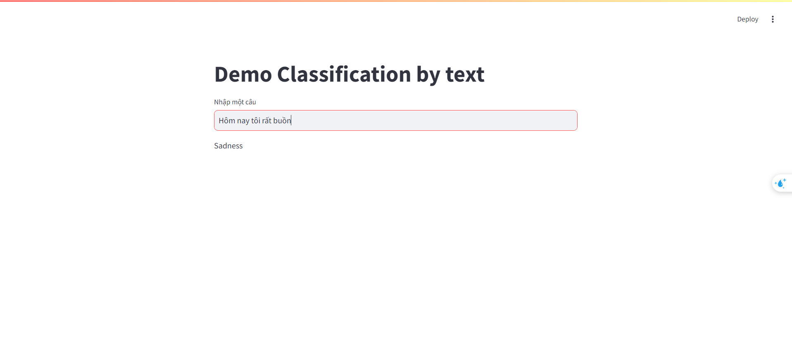

# Vietnamese Emotion Recognition
 
 Cảm xúc của con người được chia thành 7 loại cảm xúc cơ bản: Vui, Buồn, Tức giận, Ngạc nhiên, Kinh tởm, Sợ hãi và Other(Các cảm xúc khác). Tôi xây dựng một trang web có tính năng nhận diện cảm xúc dựa trên một câu hay một đoạn văn bản bất kỳ. Web xây dựng dựa trên mô hình học sâu sử dụng các mạng nơ ron như cnn, lstm và các mô hình pretrain như word2vec, fasttext. Tuy nhiên độ chính xác mô hình còn hạn chế.

# Cài đặt

Cài đặt các thư viện cần thiết
```
pip install -r requirements.txt
```

# Sử dụng
```
streamlit run str.py
```

# Image


